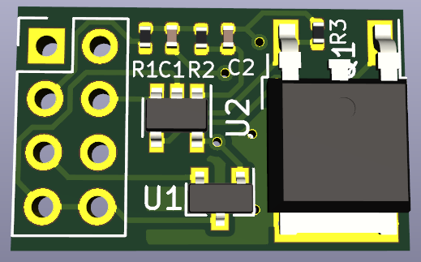
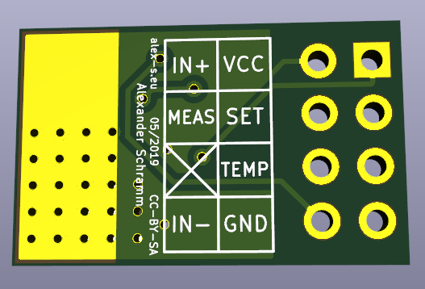
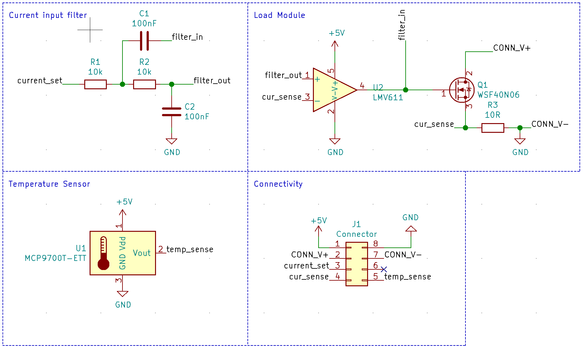

# Winzling
Winzling is a tiny electronic load.

## Why?
Why not? I wanted to see just how small I could build an electronic load. Very small as it turns out... About the size of a DIP-12 footprint to be precise. That's smaller than the ATmega328P used on the Arduino UNO. The size could be reduced further by changing a few bits and pieces:

- First off the pin header takes tons of space and creates a routing nightmare (for 2 layer boards). Small 0402-sized solderpads could do the job, they could also placed all over the board, simplifying routing a lot.
- Placing parts (at least some passives) on both PCB sides. This might make routing more difficult though.
- Placing vias under/in solder pads. Vias take up lots of space on both sides of the PCB, sharing that space with solderpads might be a good thing. However I'm not sure how well that works or if it causes any other issues.
- Reflow soldering instead of using a soldering iron. With a soldering iron you always need to consider whether part pins and solderpads are accessible. With reflow soldering that isn't as important anymore. Unfortunately reflow soldering causes other issues (especially with the mosfet's huge heatsink). Maybe a combination of both is the right way.


## How to use it?
Winzling is pretty useless by itself, you need some additional components to use it. Most importantly you need some way to generate the analog signal to set the current, you can do that using an Arduino's PWM output or by using a potentiometer. For a fixed current you could simply use a voltage divider made from two resistors.

### Pinout

Pin names are documented on the back of the board.




Pinname | Description
--------|------------
VCC|5V to power the thing⚡⚡⚡
GND|Ground... 😑
IN+|Positive end of the load⚡
IN-|Negative end of the load (Internally connected to ```GND```)
MEAS|Analog voltage corresponding to the current flowing through the load📊
SET|Analog voltage/PWM input to set the desired load current📏
TEMP|Analog temperature output🌡️

### What to build with it?
You can use Winzling to sink current...

__Warning__: The following is mostly an afterthought. I designed Winzling to be the smallest, cheapest electronic load I could manufacture. Emulating Industrial Sensors was not a design goal.

On a more serious note, you can use it to emulate an industrial sensor using an Arduino. Industrial Sensors often use current loop signalling, which requires the signal to be carried by a current between 4-20 mA. This has several advantages over voltage based signalling<sup>\[1]</sup>:

- Sensors can be powered by the 4 mA minimum current, eliminating the need for additional cables for power <sup>\[2]</sup>
- The signal is not affected by voltage drop over the sensor cable.
- Less vulnerable to noise
- Self monitoring (currents less than 3.8 mA or more than 20.5 mA are taken to indicate a fault. (e.g. cable break -> 0 mA))
- Can be carried over very long cables

<sup>\[1]</sup> [Source (Wikipedia)](https://en.wikipedia.org/wiki/Current_loop)<br>
<sup>\[2]</sup> Winzling does not implement this, but it might still work if you connect ```IN+``` to ```5V``` and connect 5-ish Volt to ```IN+```. If you want to fix this in the PCB design, you could add a small (e.g. SOT-23) 5V linear voltage regulator and connect that to ```IN+``` and ```5V```. I will accept pull requests.




## License
Everything in this git repository is licensed under the following license: <br>
Creative Commons Attribution Share Alike 4.0 International
